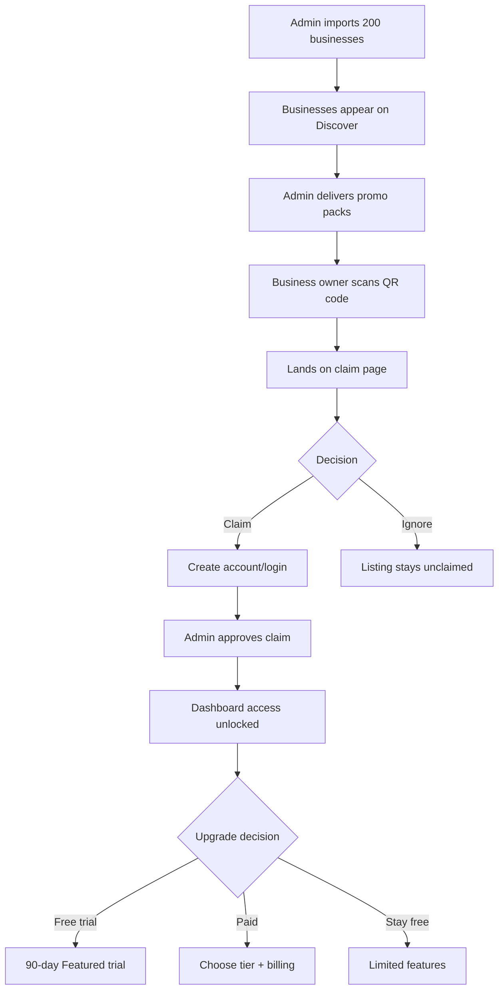

# Free Tier System - Complete UX Design

**Date:** January 6, 2026  
**Goal:** Make claiming a listing feel valuable, urgent, and easy

---

## 🎯 User Journey Overview



---

## 1. ADMIN EXPERIENCE (Franchise Owner/Admin)

### 🔧 A. Franchise Setup (First-Time Configuration)

**Page:** `/admin/settings/franchise-setup`

**Layout:**
```
┌─────────────────────────────────────────────────────────────┐
│  🏢 Franchise Configuration - Bournemouth                    │
├─────────────────────────────────────────────────────────────┤
│                                                              │
│  📍 Basic Settings                                           │
│  ├─ City: Bournemouth ✅                                     │
│  ├─ Currency: GBP (£) ✅                                     │
│  ├─ Tax: 20% VAT ✅                                          │
│  └─ Time zone: Europe/London ✅                              │
│                                                              │
│  🔑 API Keys & Services                                      │
│  ┌────────────────────────────────────────────────────────┐ │
│  │  📧 Resend Email API                                    │ │
│  │  ┌──────────────────────────────────────────────────┐  │ │
│  │  │ API Key: re_••••••••••••••••1234  [🔄 Change]    │  │ │
│  │  │ Status: ✅ Connected (last test: 2 hours ago)    │  │ │
│  │  │ [📧 Send Test Email]                              │  │ │
│  │  └──────────────────────────────────────────────────┘  │ │
│  │                                                          │ │
│  │  🗺️ Google Places API                                   │ │
│  │  ┌──────────────────────────────────────────────────┐  │ │
│  │  │ API Key: AIza••••••••••••••••xyz  [🔄 Change]    │  │ │
│  │  │ Status: ✅ Connected (quota: 987/1000 daily)     │  │ │
│  │  │ Cost this month: $12.47                           │  │ │
│  │  │ [📊 View Usage] [🧪 Test Connection]              │  │ │
│  │  └──────────────────────────────────────────────────┘  │ │
│  │                                                          │ │
│  │  💳 Stripe Connect                                       │ │
│  │  ┌──────────────────────────────────────────────────┐  │ │
│  │  │ Account: ✅ Connected to Stripe                   │  │ │
│  │  │ Payouts: Enabled                                  │  │ │
│  │  │ [⚙️ Manage Stripe Account]                        │  │ │
│  │  └──────────────────────────────────────────────────┘  │ │
│  └────────────────────────────────────────────────────────┘ │
│                                                              │
│  🎁 Founding Member Offers (Optional)                        │
│  ┌────────────────────────────────────────────────────────┐ │
│  │  [✅] Enable founding member benefits                   │ │
│  │                                                          │ │
│  │  Trial Period:  [90] days                               │ │
│  │  Discount:      [20]% off for life on annual plans     │ │
│  │  Eligibility:   [30] days from listing creation        │ │
│  │  Trial Tier:    [Featured ▼]                            │ │
│  │                                                          │ │
│  │  💡 Businesses that claim within 30 days get:          │ │
│  │     • 90-day free trial of Featured tier                │ │
│  │     • 20% lifetime discount on annual plans             │ │
│  └────────────────────────────────────────────────────────┘ │
│                                                              │
│  [💾 Save Configuration]                                    │
└─────────────────────────────────────────────────────────────┘
```

---

### 🔍 B. Business Import Tool

**Page:** `/admin/import/google-places`

**Step 1: Configure Import**

```
┌─────────────────────────────────────────────────────────────┐
│  🗺️ Import Businesses from Google Places                    │
├─────────────────────────────────────────────────────────────┤
│                                                              │
│  📍 Location                                                 │
│  ┌────────────────────────────────────────────────────────┐ │
│  │  Center: [Bournemouth, UK        ] [🎯 Use Current]   │ │
│  │  Radius: [━━━━━━●━━━] 5km                             │ │
│  │          1km         10km                               │ │
│  └────────────────────────────────────────────────────────┘ │
│                                                              │
│  🏷️ Categories (Select all that apply)                      │
│  ┌────────────────────────────────────────────────────────┐ │
│  │  [✅] Restaurants   [✅] Bars        [✅] Cafes         │ │
│  │  [✅] Nightclubs    [ ] Gyms        [ ] Spas           │ │
│  │  [ ] Salons         [ ] Hotels      [ ] Retail         │ │
│  └────────────────────────────────────────────────────────┘ │
│                                                              │
│  ⭐ Quality Filters                                          │
│  ┌────────────────────────────────────────────────────────┐ │
│  │  Minimum rating: [━━━━━━━━●━] 4.4 stars               │ │
│  │                  3.0        5.0                         │ │
│  │                                                          │ │
│  │  Minimum reviews: [━━●━━━━━━━] 50 reviews             │ │
│  │                   10         500                        │ │
│  │                                                          │ │
│  │  [✅] Must have photos (at least 3)                     │ │
│  │  [✅] Must have opening hours                           │ │
│  │  [✅] Currently open (not permanently closed)           │ │
│  └────────────────────────────────────────────────────────┘ │
│                                                              │
│  📊 Import Size                                              │
│  ┌────────────────────────────────────────────────────────┐ │
│  │  Import: [50] businesses  [━━━●━━━━━━━]               │ │
│  │          10              500                            │ │
│  │                                                          │ │
│  │  💰 Estimated Cost: $4.90                               │ │
│  │     • 50 searches @ $0.032 = $1.60                      │ │
│  │     • 50 details @ $0.017 = $0.85                       │ │
│  │     • 150 photos @ $0.007 = $1.05                       │ │
│  │                                                          │ │
│  │  ⏱️ Estimated Time: 2-3 minutes                         │ │
│  └────────────────────────────────────────────────────────┘ │
│                                                              │
│  [🔍 Preview Results] [📥 Start Import]                     │
└─────────────────────────────────────────────────────────────┘
```

**Step 2: Preview Results**

```
┌─────────────────────────────────────────────────────────────┐
│  👀 Preview: Found 53 businesses                             │
├─────────────────────────────────────────────────────────────┤
│  💡 Review before importing. Uncheck any you don't want.     │
│                                                              │
│  ┌────────────────────────────────────────────────────────┐ │
│  │ [✅] The Larder House                         ⭐ 4.6   │ │
│  │     123 Old Christchurch Rd • 847 reviews              │ │
│  │     🏷️ Restaurant • 📍 0.8km from center               │ │
│  │     📸 12 photos • 🕒 Opens 12PM-10PM                   │ │
│  └────────────────────────────────────────────────────────┘ │
│                                                              │
│  ┌────────────────────────────────────────────────────────┐ │
│  │ [✅] Aruba Restaurant                         ⭐ 4.5   │ │
│  │     20 Westover Rd • 623 reviews                       │ │
│  │     🏷️ Restaurant • 📍 1.2km from center               │ │
│  │     📸 8 photos • 🕒 Opens 5PM-11PM                     │ │
│  └────────────────────────────────────────────────────────┘ │
│                                                              │
│  ┌────────────────────────────────────────────────────────┐ │
│  │ [⚠️] The Stable (ALREADY CLAIMED)            ⭐ 4.7   │ │
│  │     This business already exists in your system        │ │
│  │     Skip to avoid duplicate                             │ │
│  └────────────────────────────────────────────────────────┘ │
│                                                              │
│  ... 50 more businesses ...                                 │
│                                                              │
│  Summary:                                                    │
│  • 52 new businesses (will be imported)                     │
│  • 1 duplicate (will be skipped)                            │
│  • Cost: $4.90 • Time: ~2 minutes                           │
│                                                              │
│  [← Back] [✅ Confirm Import (52 businesses)]                │
└─────────────────────────────────────────────────────────────┘
```

**Step 3: Import Progress**

```
┌─────────────────────────────────────────────────────────────┐
│  📥 Importing businesses...                                  │
├─────────────────────────────────────────────────────────────┤
│                                                              │
│  ████████████████████████░░░░ 47/52 (90%)                   │
│                                                              │
│  ✅ The Larder House - Imported                             │
│  ✅ Aruba Restaurant - Imported                             │
│  ✅ Urban Reef - Imported                                   │
│  ⏳ Importing: West Beach Bar & Kitchen...                  │
│  ⏸️  Pending: 5 more businesses                             │
│                                                              │
│  💰 Cost so far: $4.60 / $4.90                              │
│  ⏱️ Time elapsed: 1m 43s                                    │
│                                                              │
│  [❌ Cancel Import]                                          │
└─────────────────────────────────────────────────────────────┘
```

**Step 4: Import Complete**

```
┌─────────────────────────────────────────────────────────────┐
│  ✅ Import Complete!                                         │
├─────────────────────────────────────────────────────────────┤
│                                                              │
│  📊 Results Summary                                          │
│  ┌────────────────────────────────────────────────────────┐ │
│  │  ✅ Successfully imported: 52 businesses                │ │
│  │  ⏭️  Skipped (duplicates): 1 business                   │ │
│  │  ❌ Failed: 0 businesses                                │ │
│  │                                                          │ │
│  │  💰 Final cost: $4.90                                   │ │
│  │  ⏱️ Total time: 2m 17s                                  │ │
│  └────────────────────────────────────────────────────────┘ │
│                                                              │
│  🎯 Next Steps                                               │
│  ┌────────────────────────────────────────────────────────┐ │
│  │  1. Review imported businesses                          │ │
│  │     [👀 View All 52 Businesses]                         │ │
│  │                                                          │ │
│  │  2. Generate promo pack QR codes                        │ │
│  │     [🖨️ Generate 52 QR Codes]                           │ │
│  │                                                          │ │
│  │  3. Print & deliver promo packs                         │ │
│  │     [📦 Download Promo Pack Templates]                  │ │
│  │                                                          │ │
│  │  4. Monitor claims                                       │ │
│  │     [📊 Go to Claims Dashboard]                         │ │
│  └────────────────────────────────────────────────────────┘ │
│                                                              │
│  [✅ Done] [📥 Import More Businesses]                       │
└─────────────────────────────────────────────────────────────┘
```

---

### 👥 C. Claim Approvals Dashboard

**Page:** `/admin/claims`

```
┌─────────────────────────────────────────────────────────────┐
│  👥 Claim Requests (3 pending)                               │
├─────────────────────────────────────────────────────────────┤
│                                                              │
│  🔔 NEW: 3 claims waiting for approval                       │
│                                                              │
│  ┌────────────────────────────────────────────────────────┐ │
│  │  👤 Sarah Williams → The Larder House                   │ │
│  │     📧 sarah@thelarderhouse.com                         │ │
│  │     📅 Claimed 2 hours ago                              │ │
│  │                                                          │ │
│  │     Business Details:                                    │ │
│  │     • 847 reviews, 4.6★ on Google                       │ │
│  │     • 123 Old Christchurch Rd                           │ │
│  │     • Created 15 days ago (✅ Founding member eligible) │ │
│  │                                                          │ │
│  │     Verification:                                        │ │
│  │     • Email domain matches website ✅                   │ │
│  │     • Email verified: sarah@thelarderhouse.com ✅       │ │
│  │                                                          │ │
│  │     If approved, Sarah will get:                        │ │
│  │     • ✨ 90-day Featured tier trial                     │ │
│  │     • 🏅 Founding member (20% off for life)            │ │
│  │     • 📊 Dashboard access                               │ │
│  │                                                          │ │
│  │     [✅ Approve] [❌ Deny] [💬 Request More Info]        │ │
│  └────────────────────────────────────────────────────────┘ │
│                                                              │
│  ┌────────────────────────────────────────────────────────┐ │
│  │  👤 Mark Johnson → Urban Reef                           │ │
│  │     📧 mark@urbanreef.co.uk                             │ │
│  │     📅 Claimed 5 hours ago                              │ │
│  │                                                          │ │
│  │     ⚠️ POTENTIAL ISSUE:                                 │ │
│  │     • Email domain doesn't match website                │ │
│  │     • Website: www.urban-reef.co.uk                     │ │
│  │     • Claiming email: mark@urbanreef.co.uk              │ │
│  │                                                          │ │
│  │     [✅ Approve Anyway] [❌ Deny] [💬 Ask for Proof]     │ │
│  └────────────────────────────────────────────────────────┘ │
│                                                              │
│  View: [Pending (3)] [Approved (12)] [Denied (1)]           │
└─────────────────────────────────────────────────────────────┘
```

---

## 2. BUSINESS OWNER EXPERIENCE

### 📦 A. Promo Pack Design

**Physical Package Contents:**
```
┌──────────────────────────────────────┐
│  🎁 You're Already on QWIKKER!       │
│                                      │
│  [QR CODE]                           │
│  Scan to claim your FREE listing    │
│                                      │
│  ✨ What You Get (Free):             │
│  • Visible to 1,000+ local customers│
│  • Business profile with photos     │
│  • Hours & contact info displayed   │
│                                      │
│  🚀 Claim Within 30 Days For:        │
│  • 90-day Featured tier trial       │
│  • 20% off FOR LIFE (annual plans)  │
│  • AI recommendations                │
│  • Create special offers             │
│  • Secret menu access                │
│                                      │
│  Or... [Remove My Listing]           │
│                                      │
│  www.qwikker.com/claim/your-slug    │
└──────────────────────────────────────┘
```

---

### 🔗 B. Claim Landing Page

**URL:** `qwikker.com/claim/the-larder-house`

**Initial View (Before Login)**

```
┌─────────────────────────────────────────────────────────────┐
│  [QWIKKER Logo]                         [🏠 Home] [📱 App]  │
└─────────────────────────────────────────────────────────────┘

     ┌─────────────────────────────────────────────────┐
     │  🎉 Great news! You're already on QWIKKER       │
     │                                                  │
     │  🏢 The Larder House                            │
     │  ⭐ 4.6 stars • 847 reviews                     │
     │  📍 123 Old Christchurch Rd, Bournemouth        │
     │                                                  │
     │  [Gallery: 5 photos from Google]                │
     │                                                  │
     │  📊 Your Listing Performance (Last 7 Days)      │
     │  ┌──────────────────────────────────────────┐  │
     │  │  👁️  143 profile views                   │  │
     │  │  🔍 47 search appearances                 │  │
     │  │  📱 23 phone clicks                       │  │
     │  │  🗺️  31 directions requests               │  │
     │  └──────────────────────────────────────────┘  │
     │                                                  │
     │  ⏰ Limited Time Offer (15 days remaining)      │
     │  ┌──────────────────────────────────────────┐  │
     │  │  Claim this listing to unlock:            │  │
     │  │                                            │  │
     │  │  ✨ 90-Day Featured Trial (Worth £165)    │  │
     │  │  • AI recommendations to customers         │  │
     │  │  • Create exclusive offers                 │  │
     │  │  • Secret menu feature                     │  │
     │  │  • Priority placement                      │  │
     │  │                                            │  │
     │  │  🏅 Founding Member Status                 │  │
     │  │  • 20% OFF for life (annual plans)        │  │
     │  │  • Exclusive "Founding Member" badge      │  │
     │  │  • Priority support                        │  │
     │  │                                            │  │
     │  │  📊 Full Dashboard Access                  │  │
     │  │  • Analytics & insights                    │  │
     │  │  • Customer engagement tools               │  │
     │  │  • QR codes & marketing materials          │  │
     │  └──────────────────────────────────────────┘  │
     │                                                  │
     │       [🚀 Claim Your Listing (Free)]            │
     │                                                  │
     │       Or: [❌ Remove My Listing]                │
     │                                                  │
     └─────────────────────────────────────────────────┘

     💬 "QWIKKER has been fantastic for getting locals
        through our door. The offers feature is a game-
        changer!" - David, David's Grill Shack
```

---

**After Clicking "Claim Your Listing"**

```
┌─────────────────────────────────────────────────────────────┐
│  Claiming: The Larder House                                  │
├─────────────────────────────────────────────────────────────┤
│                                                              │
│  📧 Verify Ownership                                         │
│                                                              │
│  To protect business owners, we need to verify you own      │
│  The Larder House.                                           │
│                                                              │
│  ┌────────────────────────────────────────────────────────┐ │
│  │  Option 1: Email Verification (Fastest)                 │ │
│  │  ───────────────────────────────────────────────        │ │
│  │  We'll send a code to your business email               │ │
│  │                                                          │ │
│  │  📧 Email: [sarah@thelarderhouse.com     ]              │ │
│  │                                                          │ │
│  │  [📧 Send Verification Code]                            │ │
│  └────────────────────────────────────────────────────────┘ │
│                                                              │
│  ┌────────────────────────────────────────────────────────┐ │
│  │  Option 2: Manual Verification                          │ │
│  │  ───────────────────────────────────────                │ │
│  │  If you don't have access to the business email,       │ │
│  │  we can verify manually (1-2 business days)            │ │
│  │                                                          │ │
│  │  [📄 Upload Business License or Proof]                  │ │
│  └────────────────────────────────────────────────────────┘ │
│                                                              │
│  [← Back]                                                    │
└─────────────────────────────────────────────────────────────┘
```

---

**After Email Verification**

```
┌─────────────────────────────────────────────────────────────┐
│  📧 Check Your Email                                         │
├─────────────────────────────────────────────────────────────┤
│                                                              │
│  We've sent a 6-digit code to:                              │
│  sarah@thelarderhouse.com                                    │
│                                                              │
│  ┌────────────────────────────────────────────────────────┐ │
│  │  Enter verification code:                               │ │
│  │                                                          │ │
│  │  [█] [█] [█] [█] [█] [█]                                │ │
│  │                                                          │ │
│  │  Didn't receive it? [Resend Code]                       │ │
│  └────────────────────────────────────────────────────────┘ │
│                                                              │
│  💡 Check your spam folder if you don't see it              │
│                                                              │
└─────────────────────────────────────────────────────────────┘
```

---

**After Verification Success**

```
┌─────────────────────────────────────────────────────────────┐
│  ✅ Email Verified!                                          │
├─────────────────────────────────────────────────────────────┤
│                                                              │
│  Create Your Account                                         │
│                                                              │
│  ┌────────────────────────────────────────────────────────┐ │
│  │  First Name: [Sarah                    ]                │ │
│  │  Last Name:  [Williams                 ]                │ │
│  │  Email:      sarah@thelarderhouse.com (verified) ✅     │ │
│  │  Password:   [••••••••••••            ]                 │ │
│  │  Confirm:    [••••••••••••            ]                 │ │
│  │                                                          │ │
│  │  Phone (optional): [+44 7700 900000   ]                 │ │
│  └────────────────────────────────────────────────────────┘ │
│                                                              │
│  By creating an account, you agree to our Terms & Privacy   │
│                                                              │
│  [✅ Create Account & Claim Listing]                         │
└─────────────────────────────────────────────────────────────┘
```

---

**Claim Submitted (Pending Admin Approval)**

```
┌─────────────────────────────────────────────────────────────┐
│  ⏳ Claim Request Submitted!                                 │
├─────────────────────────────────────────────────────────────┤
│                                                              │
│  🎉 Almost there, Sarah!                                     │
│                                                              │
│  Your claim for The Larder House is being reviewed by our   │
│  Bournemouth team. This usually takes 1-2 business days.    │
│                                                              │
│  ┌────────────────────────────────────────────────────────┐ │
│  │  What happens next:                                     │ │
│  │                                                          │ │
│  │  1. ⏳ Review (1-2 business days)                        │ │
│  │     Our team verifies your claim                        │ │
│  │                                                          │ │
│  │  2. 📧 Approval notification                             │ │
│  │     You'll receive an email when approved               │ │
│  │                                                          │ │
│  │  3. 🚀 Dashboard access                                  │ │
│  │     Start your 90-day Featured trial                    │ │
│  │                                                          │ │
│  │  4. 🎨 Customize your listing                            │ │
│  │     Add your personal touch                             │ │
│  └────────────────────────────────────────────────────────┘ │
│                                                              │
│  📧 We've sent a confirmation to:                            │
│  sarah@thelarderhouse.com                                    │
│                                                              │
│  Questions? Email us: bournemouth@qwikker.com               │
│                                                              │
│  [🏠 Back to Homepage]                                       │
└─────────────────────────────────────────────────────────────┘
```

---

### 🎉 C. Post-Approval Experience

**Email Notification:**

```
Subject: 🎉 Your QWIKKER listing is approved!

Hi Sarah,

Great news! Your claim for The Larder House has been approved.

You now have:
✨ 90-day Featured tier trial (worth £165)
🏅 Founding member status (20% off for life)
📊 Full dashboard access

Next steps:
1. Complete your profile (10 minutes)
2. Add your menu & photos
3. Create your first offer

[🚀 Access Your Dashboard]

Your trial ends: April 15, 2026
After that: £59/month or £590/year (with 20% founding member discount)

Welcome to QWIKKER!
Team Bournemouth
```

---

**First Login to Dashboard**

```
┌─────────────────────────────────────────────────────────────┐
│  🎉 Welcome to QWIKKER, Sarah!                               │
├─────────────────────────────────────────────────────────────┤
│                                                              │
│  Your 90-day Featured trial has started! ✨                 │
│  Trial ends: April 15, 2026 (87 days remaining)             │
│                                                              │
│  ┌────────────────────────────────────────────────────────┐ │
│  │  🎯 Complete Your Profile (4/10 steps)                  │ │
│  │                                                          │ │
│  │  ✅ Business name                                       │ │
│  │  ✅ Address                                             │ │
│  │  ✅ Phone number                                        │ │
│  │  ✅ Opening hours                                       │ │
│  │  ⏹️  Add description (Tell customers about you!)       │ │
│  │  ⏹️  Upload logo                                        │ │
│  │  ⏹️  Add menu                                           │ │
│  │  ⏹️  Add more photos                                    │ │
│  │  ⏹️  Create your first offer                            │ │
│  │  ⏹️  Submit for final approval                          │ │
│  │                                                          │ │
│  │  [▶️ Continue Setup (6 minutes)]                         │ │
│  └────────────────────────────────────────────────────────┘ │
│                                                              │
│  💡 Pro tip: Businesses with complete profiles get 3x more │
│     engagement than incomplete ones.                        │
│                                                              │
│  ┌────────────────────────────────────────────────────────┐ │
│  │  🎓 Getting Started Guide                               │ │
│  │  • How to create winning offers                         │ │
│  │  • Best practices for menus                             │ │
│  │  • Maximizing your QWIKKER profile                      │ │
│  │  [📚 View Guide]                                        │ │
│  └────────────────────────────────────────────────────────┘ │
│                                                              │
└─────────────────────────────────────────────────────────────┘
```

---

## 3. APP USER EXPERIENCE (Customer Side)

### 🔍 A. Discover Page (Free + Paid Businesses)

```
┌─────────────────────────────────────────────────────────────┐
│  🔍 Discover Bournemouth                   [Filter] [Sort]  │
├─────────────────────────────────────────────────────────────┤
│                                                              │
│  🏆 QWIKKER PICKS (Featured & Spotlight)                    │
│  ┌────────────────────────────────────────────────────────┐ │
│  │  [Photo] David's Grill Shack        ⭐ 4.8 • £££      │ │
│  │  🎟️ 2 offers available • 🍽️ Secret menu               │ │
│  │  🏅 Featured Business                                   │ │
│  └────────────────────────────────────────────────────────┘ │
│                                                              │
│  ┌────────────────────────────────────────────────────────┐ │
│  │  [Photo] Ember & Oak Bistro         ⭐ 4.7 • ££       │ │
│  │  🎟️ 1 offer available                                  │ │
│  │  🏅 Featured Business                                   │ │
│  └────────────────────────────────────────────────────────┘ │
│                                                              │
│  📍 ALL BOURNEMOUTH BUSINESSES                               │
│  ┌────────────────────────────────────────────────────────┐ │
│  │  [Photo] The Larder House           ⭐ 4.6 • ££       │ │
│  │  Restaurant • 0.8km away                                │ │
│  │  (No special offers at this time)                       │ │
│  └────────────────────────────────────────────────────────┘ │
│                                                              │
│  ┌────────────────────────────────────────────────────────┐ │
│  │  [Photo] Urban Reef                 ⭐ 4.5 • £££      │ │
│  │  Beach Restaurant • 1.2km away                          │ │
│  │  (No special offers at this time)                       │ │
│  └────────────────────────────────────────────────────────┘ │
│                                                              │
│  💡 Some businesses haven't joined QWIKKER's offer program │
│     yet, but we've listed them for your convenience.       │
│                                                              │
└─────────────────────────────────────────────────────────────┘
```

**Key UX Decisions:**
- Free tier businesses are visible but clearly don't have offers
- Featured/Spotlight businesses stand out with badges
- No "unclaimed" badge shown to customers (internal only)
- Free tier listings look professional, not "lesser"

---

### 💬 B. AI Chat (Free Tier EXCLUDED)

**User:** "Where can I get good seafood?"

**AI Response:**
```
Based on your seafood craving, I'd recommend:

🏆 **Urban Reef** (Featured Business)
⭐ 4.5 stars • ££-£££ • Beach restaurant
They're known for fresh catch and stunning sea views.
📍 West Beach, 1.2km from you

🏆 **WestBeach** (Featured Business)
⭐ 4.6 stars • ££ • Modern British with seafood focus
Right on the beach with great cocktails too!
📍 Pier Approach, 0.9km from you

Both have current offers:
🎟️ Urban Reef: 20% off dinner (Sun-Thu)
🎟️ WestBeach: 2-for-1 cocktails with any seafood dish

Want to see the offer details?
```

**Important:** The Larder House (free tier) is NOT mentioned, even though it might serve seafood. This is BY DESIGN.

---

## 4. KEY UX PRINCIPLES

### ✨ For Business Owners (Claim Flow)

1. **Urgency without Pressure**
   - "15 days remaining" (creates urgency)
   - "Or stay free" (no hard sell)
   - Founding member benefits are clear and valuable

2. **Social Proof**
   - Show real metrics (views, clicks)
   - Testimonials from existing businesses
   - Display competitor businesses already on QWIKKER

3. **Simplicity**
   - 3-step process: Scan → Verify → Access
   - Pre-filled data from Google (less work)
   - Clear "what you get" messaging

4. **Trust**
   - Email verification (security)
   - Admin review (quality control)
   - Professional design (legitimate platform)

5. **Value Clarity**
   - "Worth £165" (quantify trial value)
   - "20% OFF for life" (clear savings)
   - Show metrics ("1,000+ local customers")

---

### 🎯 For Franchise Admins

1. **Transparency**
   - Live cost calculator
   - Progress tracking
   - Clear results summary

2. **Control**
   - Batch size selector
   - Quality filters (rating, reviews)
   - Preview before import
   - Manual approval of claims

3. **Efficiency**
   - Bulk operations
   - Auto-import capabilities
   - One-click QR generation
   - Template downloads

4. **Safety**
   - Duplicate detection
   - Verification checks
   - Audit trail
   - Rollback options

---

### 👥 For App Users

1. **Clarity**
   - Clear distinction between free and paid (without being obvious)
   - Featured businesses stand out
   - Free businesses still look professional

2. **No Confusion**
   - Free tier businesses visible in Discover ✅
   - Free tier businesses NOT in AI chat ✅
   - No "this business isn't good enough" messaging

3. **Value**
   - AI recommends the best (paid businesses with offers)
   - Discover shows everything (browsing freedom)
   - No degraded experience

---

## 5. COPY & MESSAGING GUIDELINES

### ❌ DON'T SAY:
- "This business hasn't claimed their listing"
- "Upgrade to be included in AI"
- "Free tier (limited features)"
- "This is just a basic listing"

### ✅ DO SAY:
- "Claim your FREE listing"
- "Unlock AI recommendations"
- "No special offers at this time"
- "Featured businesses"

### 🎨 Visual Hierarchy:
1. **Spotlight** - Gold badge, top placement
2. **Featured** - Blue badge, prominent placement
3. **Starter** - Green badge, standard placement
4. **Free** - No badge, standard placement

---

## 📊 Success Metrics for UX

**Claim Conversion:**
- Target: 50% of promo pack deliveries → claims
- Track: QR scans, page visits, claim submissions

**Completion Rate:**
- Target: 80% who start claim process → complete it
- Drop-off points: Email verification, account creation

**Time to Value:**
- Target: < 10 minutes from scan to dashboard access
- Minimize friction at every step

**Trial → Paid Conversion:**
- Target: 50% of trials convert to paying customers
- Key: Show value early and often

---

## 🎯 Next Steps

Once you approve this UX design:
1. I'll create mockup components in Figma/Wireframes
2. Build the claim landing page
3. Build the admin import tool UI
4. Create the claim approval dashboard
5. Design email templates

**Ready to proceed with this UX design?** 🚀

