# QWIKKER System Entities - User vs Business vs Subscription

**Last Updated:** January 6, 2026

---

## The Three Core Entities

### 1. 👤 USER ACCOUNTS (`auth.users`)

**What it is:** Supabase Auth's built-in user authentication table

**Who it contains:**
- App users (people browsing restaurants on their phone)
- Business owners (people who manage business dashboards)
- Admins (franchise owners/staff)

**Primary Key:** `auth.users.id` (UUID)

**Example:**
```
auth.users
├── id: "123e4567-e89b-12d3-a456-426614174000"  ← Sarah (app user)
├── id: "987f6543-e21c-34d5-a678-426614174001"  ← John (business owner of David's Grill)
└── id: "456a7890-e12d-56e7-a890-426614174002"  ← You (admin)
```

---

### 2. 🏢 BUSINESSES (`business_profiles`)

**What it is:** The actual businesses/restaurants/venues

**Primary Key:** `business_profiles.id` (UUID)

**Key Columns:**
- `id` - The business's unique identifier
- `user_id` - References `auth.users.id` (the business OWNER's account)
- `business_name` - "David's Grill Shack"
- `city` - "bournemouth"
- `plan` - "spotlight"
- `status` - "approved"

**Example:**
```
business_profiles
├── id: "aaa-111"
│   user_id: "987f6543-e21c-34d5-a678-426614174001"  ← John owns this business
│   business_name: "David's Grill Shack"
│   plan: "spotlight"
│
├── id: "bbb-222"
│   user_id: "987f6543-e21c-34d5-a678-426614174001"  ← John ALSO owns this business
│   business_name: "Ember & Oak Bistro"
│   plan: "starter"
│
└── id: "ccc-333"
    user_id: NULL  ← UNCLAIMED (imported from Google, no owner yet)
    business_name: "Coastal Cafe"
    plan: "free"
```

**Key Point:** One user can own MULTIPLE businesses (John owns both David's and Ember & Oak)

---

### 3. 💳 SUBSCRIPTIONS (`business_subscriptions`)

**What it is:** The subscription records linking businesses to pricing tiers

**Primary Key:** `business_subscriptions.id` (UUID)

**Key Columns:**
- `id` - The subscription record's unique ID
- `business_id` - References `business_profiles.id` (which business is subscribed)
- `tier_id` - References `subscription_tiers.id` (which tier they're on)
- `status` - "trial", "active", "cancelled"
- `is_in_free_trial` - boolean
- `free_trial_end_date` - when trial expires

**Example:**
```
business_subscriptions
├── id: "sub-001"
│   business_id: "aaa-111"  ← David's Grill Shack
│   tier_id: "tier-spotlight"
│   status: "active"
│   is_in_free_trial: false
│
└── id: "sub-002"
    business_id: "bbb-222"  ← Ember & Oak Bistro
    tier_id: "tier-starter"
    status: "trial"
    is_in_free_trial: true
    free_trial_end_date: "2026-04-15"
```

---

## 4. 📊 SUBSCRIPTION TIERS (`subscription_tiers`)

**What it is:** The pricing plans (Starter, Featured, Spotlight, etc.)

**Primary Key:** `subscription_tiers.id` (UUID)

**Key Columns:**
- `id` - The tier's unique ID
- `tier_name` - "starter", "featured", "spotlight"
- `tier_display_name` - "Starter Plan"
- `monthly_price` - 29.00
- `features` - JSONB of included features

**Example:**
```
subscription_tiers
├── id: "tier-free"
│   tier_name: "free"
│   tier_display_name: "Free Listing"
│   monthly_price: 0.00
│
├── id: "tier-starter"
│   tier_name: "starter"
│   tier_display_name: "Starter Plan"
│   monthly_price: 29.00
│
├── id: "tier-featured"
│   tier_name: "featured"
│   tier_display_name: "Featured Business"
│   monthly_price: 79.00
│
└── id: "tier-spotlight"
    tier_name: "spotlight"
    tier_display_name: "Spotlight Premium"
    monthly_price: 149.00
```

---

## How They All Connect (Full Example)

### Scenario: John owns two businesses

```mermaid
graph LR
    User["👤 User: John<br/>auth.users.id:<br/>987f6543..."] 
    
    Biz1["🏢 Business 1<br/>David's Grill<br/>business_profiles.id:<br/>aaa-111<br/>user_id: 987f6543..."]
    
    Biz2["🏢 Business 2<br/>Ember & Oak<br/>business_profiles.id:<br/>bbb-222<br/>user_id: 987f6543..."]
    
    Sub1["💳 Subscription 1<br/>business_subscriptions.id:<br/>sub-001<br/>business_id: aaa-111<br/>tier_id: tier-spotlight"]
    
    Sub2["💳 Subscription 2<br/>business_subscriptions.id:<br/>sub-002<br/>business_id: bbb-222<br/>tier_id: tier-starter"]
    
    Tier1["📊 Tier: Spotlight<br/>subscription_tiers.id:<br/>tier-spotlight<br/>price: £149/mo"]
    
    Tier2["📊 Tier: Starter<br/>subscription_tiers.id:<br/>tier-starter<br/>price: £29/mo"]
    
    User -->|owns| Biz1
    User -->|owns| Biz2
    Biz1 -->|has| Sub1
    Biz2 -->|has| Sub2
    Sub1 -->|on tier| Tier1
    Sub2 -->|on tier| Tier2
```



**In Plain English:**
1. John creates an account → `auth.users` (user_id: 987f...)
2. John registers David's Grill → `business_profiles` (business_id: aaa-111, user_id: 987f...)
3. David's Grill gets a subscription → `business_subscriptions` (business_id: aaa-111, tier_id: tier-spotlight)
4. That subscription is on the Spotlight tier → `subscription_tiers` (id: tier-spotlight)

---

## The FREE TIER Claim System (New Addition)

### Current System (Before Free Tier):
```
1. User creates account (auth.users)
2. User fills onboarding form
3. Creates business_profiles record (user_id = their account)
4. Business gets approved
5. Business gets subscription record
```

### New System (With Free Tier + Claim):
```
1. ADMIN imports business from Google
   → business_profiles created (user_id = NULL, claim_status = 'unclaimed')
   
2. Business owner finds their listing
   → Clicks "Claim this listing"
   
3. Owner creates account (if they don't have one)
   → auth.users record created
   
4. Claim request created
   → claim_requests (business_id, user_id, status = 'pending')
   
5. Admin approves claim
   → business_profiles.owner_user_id = user_id
   → claim_status = 'claimed'
   
6. Owner upgrades to paid plan
   → business_subscriptions created
```

---

## The Confusion: `user_id` vs `owner_user_id`

### Problem:
You currently have `business_profiles.user_id` which references the business owner.

But for the FREE TIER system, unclaimed businesses have NO owner yet.

### Solution:
We're adding a NEW column: `owner_user_id`

**During Transition:**
- **Old System:** `user_id` = business owner (NOT NULL, required)
- **New System:** `owner_user_id` = business owner (NULL for unclaimed businesses)

**Migration Strategy:**
```sql
-- Add new column
ALTER TABLE business_profiles 
ADD COLUMN owner_user_id UUID REFERENCES auth.users(id);

-- Copy existing data
UPDATE business_profiles 
SET owner_user_id = user_id 
WHERE user_id IS NOT NULL;

-- Future: Deprecate user_id once we've fully migrated
```

**Why not just rename `user_id` to `owner_user_id`?**
- Would require updating 77 files
- High risk of breaking existing functionality
- Easier to run both in parallel during transition

---

## Summary Table

| Table | Primary Key | Purpose | Example Value |
|-------|------------|---------|---------------|
| `auth.users` | `id` | User accounts (app users + business owners) | `987f6543-e21c-34d5-a678-426614174001` |
| `business_profiles` | `id` | Businesses/venues | `aaa-111-business-id` |
| `business_profiles` | `user_id` | OLD: References owner's auth.users.id | `987f6543...` |
| `business_profiles` | `owner_user_id` | NEW: References owner's auth.users.id (nullable) | `987f6543...` or `NULL` |
| `business_subscriptions` | `id` | Subscription records | `sub-001` |
| `business_subscriptions` | `business_id` | Which business is subscribed | `aaa-111-business-id` |
| `business_subscriptions` | `tier_id` | Which tier they're on | `tier-spotlight` |
| `subscription_tiers` | `id` | Pricing tiers | `tier-spotlight` |

---

## Key Takeaways

1. **Users ≠ Businesses**
   - A user is a PERSON with an account
   - A business is a VENUE/RESTAURANT
   - One user can own multiple businesses

2. **`user_id` in `business_profiles` = Who Owns This Business**
   - Currently: `user_id` (old system)
   - Future: `owner_user_id` (new system, nullable for unclaimed)

3. **`business_id` in `business_subscriptions` = Which Business is Subscribed**
   - Links the subscription to the business

4. **`tier_id` in `business_subscriptions` = Which Plan They're On**
   - Links the subscription to the pricing tier (Starter, Featured, Spotlight)

5. **App Users Don't Have Businesses**
   - Sarah (app user) has an `auth.users` record but NO `business_profiles` record
   - John (business owner) has an `auth.users` record AND one or more `business_profiles` records

---

## Does This Clear Things Up?

The confusion comes from having multiple "ID" columns with different purposes:
- `auth.users.id` = person's account
- `business_profiles.id` = business entity
- `business_profiles.user_id` / `owner_user_id` = who owns the business
- `business_subscriptions.id` = subscription record
- `business_subscriptions.business_id` = which business
- `business_subscriptions.tier_id` = which pricing plan

**Think of it like this:**
- 👤 **Person** (user_id) 
- 🏢 **Owns** (business_id)
- 💳 **Pays for** (subscription_id)
- 📊 **On a tier** (tier_id)

**John (user_id: 987f...) owns David's Grill (business_id: aaa-111) which has a subscription (sub-001) on the Spotlight tier (tier-spotlight).**

Clear now? 🎯

