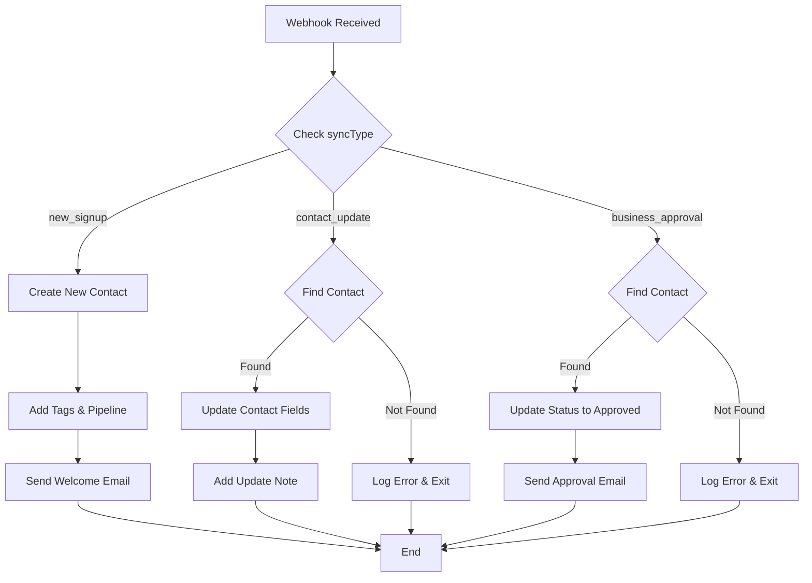

# 🔗 GHL WORKFLOW OPTIONS: Single vs Separate

## 🤔 YOUR CURRENT SETUP:
- ✅ **Signup Workflow EXISTS** - Creates contacts from onboarding
- ❌ **Update Workflow MISSING** - No way to update existing contacts

---

## **OPTION 1: 🔄 SINGLE WORKFLOW (Recommended)**

### **✅ PROS:**
- **Simpler to manage** - One workflow to maintain
- **Less webhook URLs** - Use same endpoint
- **Easier debugging** - All logic in one place
- **Cost effective** - Fewer workflow executions

### **❌ CONS:**
- **More complex logic** - Need to check if contact exists
- **Longer workflow** - More steps to handle both cases

### **🛠️ HOW IT WORKS:**
```
Webhook Trigger → Check if Contact Exists → Branch:
├── Contact EXISTS → Update existing contact
└── Contact NOT EXISTS → Create new contact
```

---

## **OPTION 2: 🔀 SEPARATE WORKFLOWS**

### **✅ PROS:**
- **Cleaner logic** - Each workflow has one purpose
- **Easier to test** - Test create/update separately
- **Better error handling** - Specific error messages
- **Clearer analytics** - Separate success/failure rates

### **❌ CONS:**
- **More complex setup** - Two workflows to maintain
- **More webhook URLs** - Need separate endpoints
- **Harder to debug** - Logic spread across workflows

### **🛠️ HOW IT WORKS:**
```
Signup Webhook → Create Contact Workflow
Update Webhook → Update Contact Workflow
```

---

## **🎯 MY RECOMMENDATION: SINGLE WORKFLOW**

**Since your signup workflow already works, let's enhance it to handle updates too!**

### **🔧 ENHANCED WORKFLOW LOGIC:**



---

## **🛠️ IMPLEMENTATION: ENHANCE YOUR EXISTING WORKFLOW**

### **Step 1: Add Condition at Start**
Add a **Condition** step right after the webhook trigger:
- **Field:** `syncType`
- **Operator:** `equals`
- **Value:** `new_signup`

### **Step 2: Create Update Branch**
Add another condition for updates:
- **Field:** `syncType` 
- **Operator:** `equals`
- **Value:** `contact_update`

### **Step 3: Add Contact Lookup**
For the update branch, add **"Get Contact"** action:
- **Search by:** Custom Field `qwikkerContactId`
- **Value:** `{{qwikkerContactId}}`

### **Step 4: Add Update Actions**
If contact found:
1. **Update Contact** with new field values
2. **Add Note:** "Updated from Qwikker Dashboard"
3. **Update Custom Field:** `lastSyncDate`

### **Step 5: Add Approval Branch**
For business approvals:
- **Field:** `syncType`
- **Operator:** `equals` 
- **Value:** `business_approval`

---

## **📝 UPDATED WEBHOOK DATA STRUCTURE:**

### **Qwikker Sends Different `syncType` Values:**

**New Signup:**
```json
{
  "syncType": "new_signup",
  "firstName": "John",
  "lastName": "Doe",
  "email": "john@business.com",
  "businessName": "John's Restaurant",
  "qwikkerContactId": "uuid-here",
  "status": "incomplete"
}
```

**Contact Update:**
```json
{
  "syncType": "contact_update", 
  "qwikkerContactId": "uuid-here",
  "firstName": "John Updated",
  "lastName": "Doe Updated", 
  "email": "john.updated@business.com",
  "updatedFields": ["firstName", "lastName", "email"],
  "updateSource": "admin"
}
```

**Business Approval:**
```json
{
  "syncType": "business_approval",
  "qwikkerContactId": "uuid-here", 
  "status": "approved",
  "approvedAt": "2025-09-20T15:30:00Z",
  "approvedBy": "admin@qwikker.com"
}
```

---

## **🔧 CURRENT CODE ALREADY SENDS DIFFERENT TYPES:**

Looking at your existing integration, we already send different `syncType` values:

```typescript
// In lib/integrations.ts
syncType: 'new_signup'           // For onboarding
syncType: 'contact_update'       // For admin updates  
syncType: 'business_approval'    // For approvals
```

**So you just need to enhance your existing workflow to handle these different types!**

---

## **⚡ QUICK IMPLEMENTATION:**

### **Option A: Enhance Existing (5 minutes)**
1. Add conditions for `syncType`
2. Add contact lookup for updates
3. Add update actions
4. Test with different sync types

### **Option B: Create Separate (15 minutes)**
1. Clone existing workflow
2. Modify for updates only
3. Create new webhook URL
4. Update environment variables
5. Test both workflows

---

## **🎯 MY STRONG RECOMMENDATION:**

**Go with Option A - Enhance your existing workflow!**

**Why?**
- ✅ **Fastest to implement** (5 minutes vs 15 minutes)
- ✅ **Uses your proven working webhook**
- ✅ **Single point of maintenance**
- ✅ **Already have the webhook URL**
- ✅ **No environment variable changes needed**

**Just add the branching logic to handle `syncType` and you're done!** 🚀
